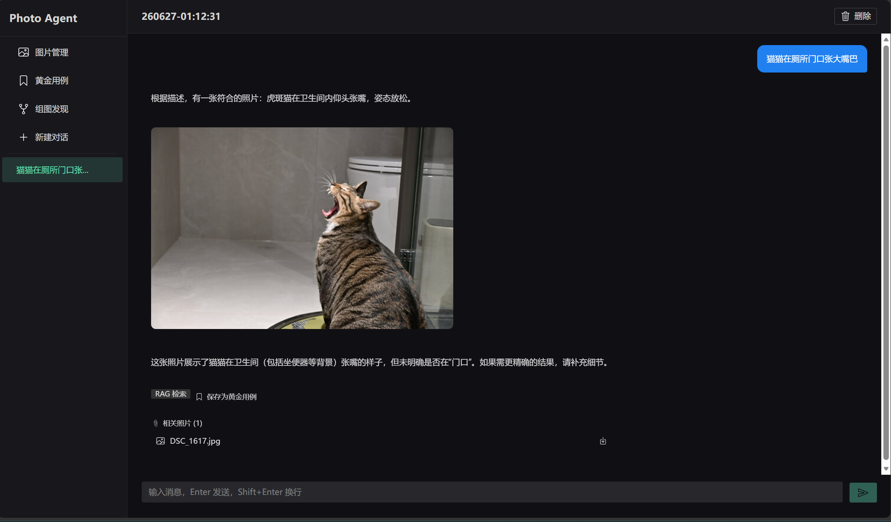
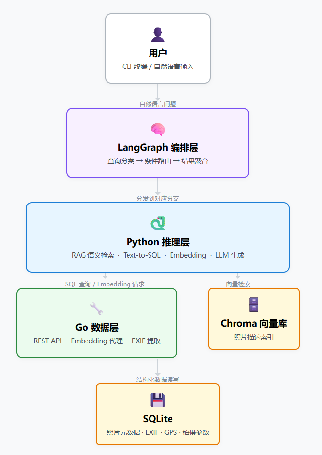

## 一、具体的痛点

"我记得有一个猫猫的照片，在厕所门口，张大嘴巴。"

每次翻相册，面对成千上万张照片，这个需求都显得奢侈。操作系统的相册只能按时间或文件名搜索，Lightroom 虽然强大但需要手动打标签——我尝试给每张照片标注"橘猫""睡觉""阳台"，坚持了不到一百张就放弃了。

于是我想：**能不能做一个能听懂自然语言的相册？** 只要我说"有猫的照片"或"猫在窗台上"，它就能把相关的照片找出来。

这就是 **Photo Agent** 的由来。而当前这个"第一个问题"已经解决了。



> 效果图

## 二、整体架构：三个角色各司其职

系统分为三层，每一层都有明确的边界和职责：



> 三层架构图

下面解释每一层为什么这样设计。

## 三、为什么要三层？每层做什么？

### 3.1 Go 数据层 —— 稳，且熟悉

我是 Go 开发者。照片的元数据（拍摄时间、焦距、光圈、相机型号、GPS 等）天然适合用关系型数据库存储。Go 提供：

- **高性能**：并发处理 EXIF 提取，批量导入数千张照片无压力。
- **强类型**：API 接口清晰，避免运行时类型错误。
- **SQLite 原生支持**：单文件数据库，零部署成本。

Go 层不关心什么是"猫"、什么是"阳台"，它只回答："给我所有 `focal_length < 50` 的照片"或"给我 `shot_at` 在 2023 年的照片"。它是纯粹的**结构化数据服务**。

此外，Go 层还承担了 **Embedding 代理**的角色——对外暴露 `/v1/embeddings` 接口，接收原始文本，转发到火山引擎等模型提供商，返回向量。Python 层不直接调用外部 embedding API，统一走 Go 代理，保持了接口的一致性。

> 其实就这么点数据量，也没什么特别道理，我喜欢/习惯用go开发后端，仅此而已。也许以后也会变成Ts/Js/Py全栈？

### 3.2 Python 推理层 —— AI 原生的能力中心

LangChain + LangGraph 是目前最成熟的 Agent 编排框架。Python 生态有：

- 最丰富的 embedding 模型（BGE、Jina、OpenAI）
- 成熟的向量数据库客户端（Chroma、Qdrant）
- LangGraph 可以实现复杂的**条件路由**和**状态管理**

这一层封装了两大核心能力：

**RAG 语义检索**（`photo_rag.py`）：用户问题 → Embedding → Chroma 检索 Top-K → 按照片聚合去重 → 拼接上下文 → LLM 生成自然语言回答。关键细节是检索结果会先按 `photo_id` 聚合（同一照片的多个 chunk 只保留相似度最高的一条），避免同一张照片在上下文中重复出现。

**Text-to-SQL**（`text_to_sql.py`）：自然语言 → 动态获取 Go 层 schema → Few-shot 示例引导 → LLM 生成 SQL → 安全校验（仅允许 SELECT）→ 通过 Go API 执行 → 格式化回答。LLM 生成的 SQL 会经过客户端和服务端双重校验，确保只读安全。

### 3.3 LangGraph 编排层 —— Agent 的大脑

这是替代 Dify 的关键。之前用 Dify 做对话管理和前端，但它是一个黑盒，工作流编排的灵活性有限。

现在用 **LangGraph 的 StateGraph** 实现了完整的查询路由，核心代码不到 50 行：

```python
class RouterState(TypedDict):
    question: str
    query_type: str      # "sql" 或 "rag"
    sql_result: dict
    rag_answer: str
    answer: str

# 构建图
g = StateGraph(RouterState)
g.add_node("classify", classify_node)     # LLM 分类器
g.add_node("sql_query", sql_node)         # Text-to-SQL 分支
g.add_node("rag_query", rag_node)         # RAG 分支
g.add_node("answer", answer_node)         # 结果聚合

g.add_edge(START, "classify")
g.add_conditional_edges("classify", route_by_type, {
    "sql": "sql_query",
    "rag": "rag_query",
})
g.add_edge("sql_query", "answer")
g.add_edge("rag_query", "answer")
g.add_edge("answer", END)
```

分类器是一个简单的 LLM prompt：

```python
CLASSIFY_SYSTEM = """
判断用户问题类型：
- sql: 涉及统计、EXIF参数、时间范围、数量聚合
- rag: 涉及内容描述、场景、物体、颜色、情感
"""
```

整个图编译后是一个 `Runnable`，调用一行代码即可：

```python
result = graph_app.invoke(
    {"question": "有橘猫的照片吗"},
    {"configurable": {"cfg": config}}
)
print(result["answer"])
```

交互界面从 Dify 的 Web UI 变成了 CLI 终端，配合 `--demo`（场景演示）、`--eval`（检索评估）、`--usage`（Token 用量统计）三个子命令，开发和调试反而更高效了。

## 四、一个完整的请求链路（以"有猫的照片"为例）

1. **用户**：在终端输入 `python chain/photo_agent.py -c config.yaml`，进入交互式聊天
2. **LangGraph 编排层**：收到 `"帮我找一些有猫的照片"`，进入 classify 节点
3. **分类器**：LLM 判断为 `rag`，条件边路由到 `rag_query` 节点
4. **RAG 检索**：调用 embedding API（通过 Go 代理）将问题向量化，在 Chroma 中检索 Top-15 个 chunk，按 `photo_id` 聚合为 Top-5 张照片
5. **LLM 生成**：将照片描述拼成上下文，由 LLM 生成自然语言回答："我找到了 12 张猫片，这是其中几张：..."
6. **Go 数据层**：Python 调用 Go 的 `/api/v1/photos` 接口，根据 ID 拉取完整的图片 URL 和元数据
7. **终端输出**：展示路由类型、检索结果、参考照片列表

整个过程用户感知到的是一次自然对话，背后三个层次各司其职。

## 五、关键设计决策与踩坑

### 决策 1：Go 作为统一 API 网关，Python 不直连 SQLite

所有数据访问——SQL 查询、照片元数据、schema 获取、embedding 调用——都通过 Go 的 REST API。Python 层完全不接触数据库或外部模型 API。

好处很实在：

- SQL 安全校验在 Go 层做**双重保险**（Python 客户端先校验，Go 服务端再校验），杜绝 SQL 注入
- 更换 embedding 提供商只需改 Go 配置，Python 代码无感
- 如果要换成 Web 前端或其他客户端，Go API 可以直接复用

### 决策 2：Embedding 代理解决 API 格式差异

LangChain 的 `OpenAIEmbeddings` 默认用 `tiktoken` 把文本预编码为 token ID 数组再发送，而 Go 代理只接受原始字符串。尝试禁用 tiktoken 后，LangChain 又 fallback 到 `transformers` tokenizer，引入这个依赖得不偿失。

最终方案：放弃 LangChain 的 embedding 封装，直接用 `httpx` 发 OpenAI 标准格式请求，代码不到 80 行。可控、可调试、没有隐式行为。

### 决策 3：评估驱动优化

构建了一个包含 6 个典型查询（"有猫的照片""日落时分""湖边的照片"等）的测试集，标注了每张照片的相关性。最终达到：

- **Precision@10 = 0.93**
- **MRR = 1.0**（第一个结果永远是相关的）

如果以后更换 embedding 模型或调整分块策略，跑一遍评估就能看到指标变化。

## 六、可复用的经验

1. **不要迷信单一框架**：Go 适合稳定的数据服务和 API 网关，LangGraph 适合精细控制 Agent 路由和状态，LangChain 适合快速搭建 RAG 链路。组合起来比选一个"全能"框架更灵活。
2. **明确三层的边界**：Go 只管结构化元数据和 API 代理，Python 推理层管 RAG 和 Text-to-SQL 能力，LangGraph 编排层管路由和状态。每一层都可以独立替换——比如未来可以把 Chroma 换成 Qdrant，编排层无感。
3. **评估先行**：没有评估指标的 RAG 系统就像没有测试的代码，你不知道改完是变好还是变坏。
4. **StateGraph 比 Chain 更适合 Agent**：当你有多个分支（SQL vs RAG）、需要共享中间状态时，用 LangGraph 的状态图比硬串 Chain 清晰得多。条件边 + TypedDict 状态，语义一目了然。
5. **Go 开发者入局 AI 没那么难**：你不需要成为调参专家。只需理解 embedding、RAG、function calling 这几个核心概念，然后用你最熟悉的语言（Go）提供工具 API 和代理，把复杂的推理交给 Python + LangGraph。

## 七、下一步

这个项目还在迭代中。我计划：

- 优化图片描述生成（VLM 输出质量）
- 本地化 embedding 模型，对比不同模型的效果
- 在 LangGraph 中加入多轮思考，支持更复杂的任务（如"先找出猫片，再从中筛选出橘猫"）
- 考虑用 LangGraph 的 `checkpointer` 实现对话记忆，替代无状态的 CLI 交互

如果你对其中某个细节感兴趣，或者想了解 Go 与 Python 的具体通信方式，欢迎留言。

---

项目代码已开源： [photo-agent](https://github.com/pancake-lee/photo-agent)
