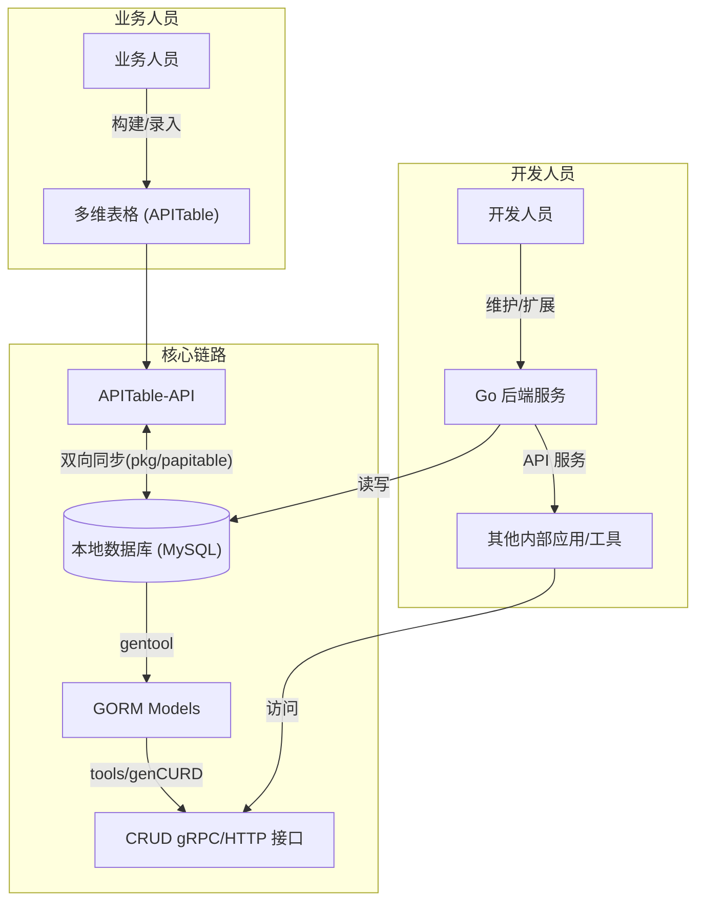

"多维表格驱动开发"这当然是我自己创造的词汇，仅仅表达字面意思，算不上什么理论方法。

## 1. 初衷与愿景

在传统的业务系统开发中，业务需求转化为数据模型通常需要经过“业务人员 -> 产品经理 -> 开发人员”的漫长沟通链路，容易出现理解偏差。

而多维表格（如 APITable、飞书多维表格）的出现，让业务人员具备了直接构建复杂数据模型的能力（其实更早的还有notion等笔记软件）。

本项目的核心愿景是建立一种**混合开发模式**：

- **前端/建模**：业务人员在多维表格中自行定义数据结构、管理基础数据，享受“开箱即用”的灵活与便捷。
- **后端/工程化**：开发人员通过工具链将多维表格的结构“固化”为本地数据库（MySQL），并自动生成高性能的后端 API 服务。

这种模式旨在兼顾业务的**敏捷性**与系统的**稳定性/扩展性**，解决纯多维表格方案在数据主权、API 速率限制、复杂事务处理等方面的短板。

## 2. 当前实现状态

项目目前已完成核心的基础设施建设，打通了“操作多维表格”与“本地代码生成”两大关键环节。

### 2.1 多维表格 封装 (`pkg/papitable`)

- **列操作**: 支持表结构定义、列管理、视图操作。
- **行读写**: 封装了行记录的增删改查。
- **双向同步** (`sync.go`): 实现了多维表格与本地数据的增量/全量同步机制。
- **附件管理** (`multiTableAttachment.go`): 处理多维表格中的文件附件。

### 2.2 自动化代码生成流水线 (`Makefile` & `tools/genCURD`)

我们构建了一套基于“现有可用代码”作为模板的生成系统，而非传统的文本模板。

- **工作流 (Makefile)**:
  1. **DB 到 ORM (`make gorm`)**: 使用 `gentool` 读取 MySQL 表结构，自动生成 GORM 查询模型 (`internal/pkg/db/query`).
  2. **ORM 到 API (`make curd`)**: 调用 `tools/genCURD`，基于标准模板生成全套 CRUD 服务代码。
- **生成器原理 (`tools/genCURD`)**:
  - **基于简单的字符串替换**: 不使用 `text/template`，而是解析一份**真实可编译运行的参考代码** (即 `abandon_code` 服务)。
  - **MARK 标记**: 通过代码中的 `// MARK REPLACE ...` 注释定位替换区域。
  - **优势**: 模板本身就是合法的 Go 代码，可直接编译、测试、重构，维护成本远低于字符串模板。

## 3. 架构设计图

## 4. 接下来的计划 (TODO)

目前的断点在于“多维表格结构”到“MySQL表结构”的自动化转化。补齐这一环将闭合整个自动化链路。

- 开发 `Schema Converter` 工具
  - **输入**: 读取 APITable 的表结构（字段名、字段类型、关联关系）。
  - **输出**: 生成 MySQL 的 `CREATE TABLE` DDL 语句或直接执行建表。
  - **难点**: 映射多维表格的特殊字段（如单选/多选标签、成员、双向关联）到关系型数据库范式。

- 适配飞书多维表格或企业微信智能表格，扩大适用场景。
