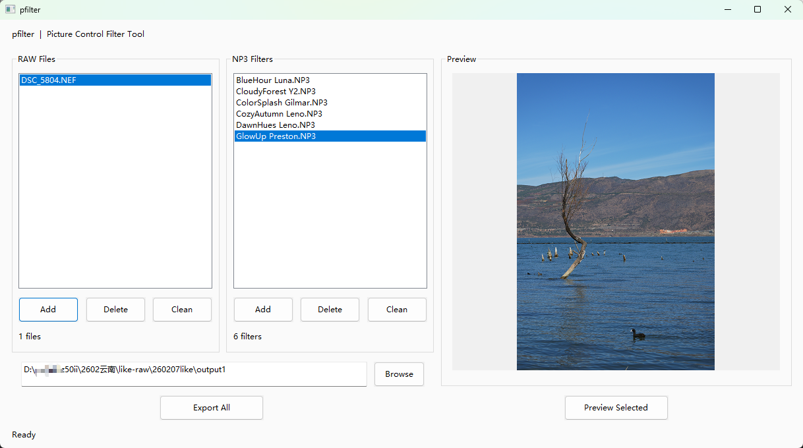
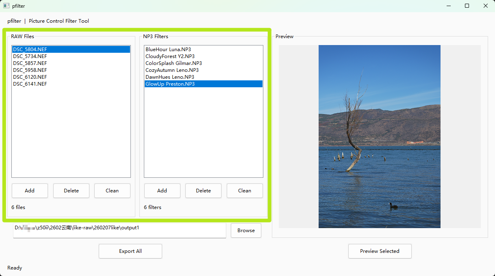
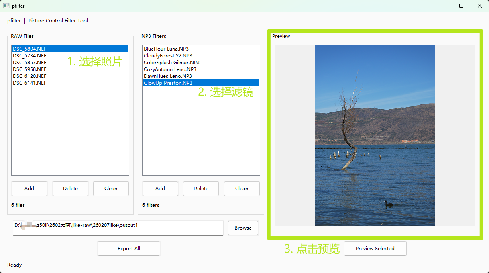
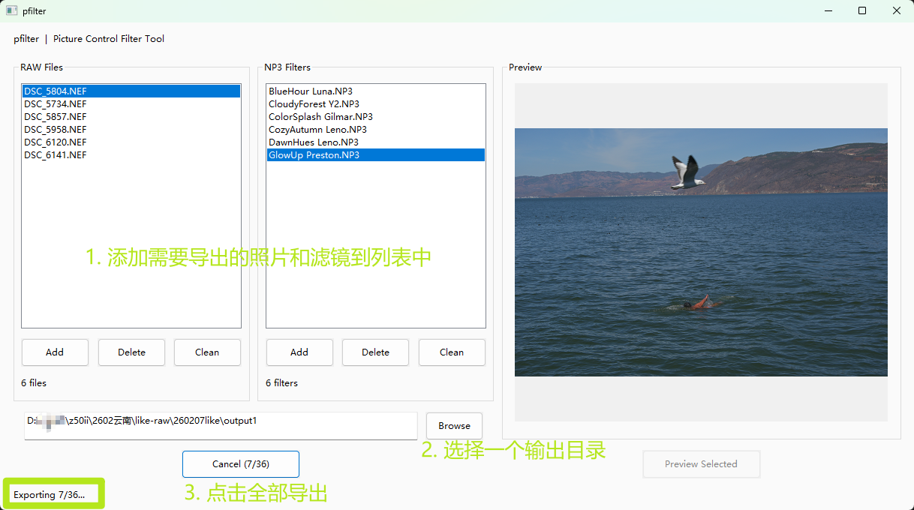
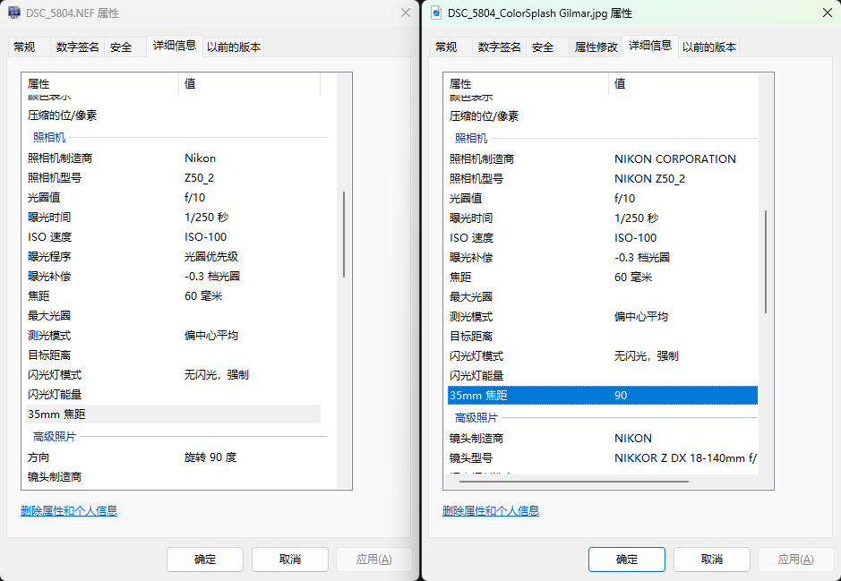
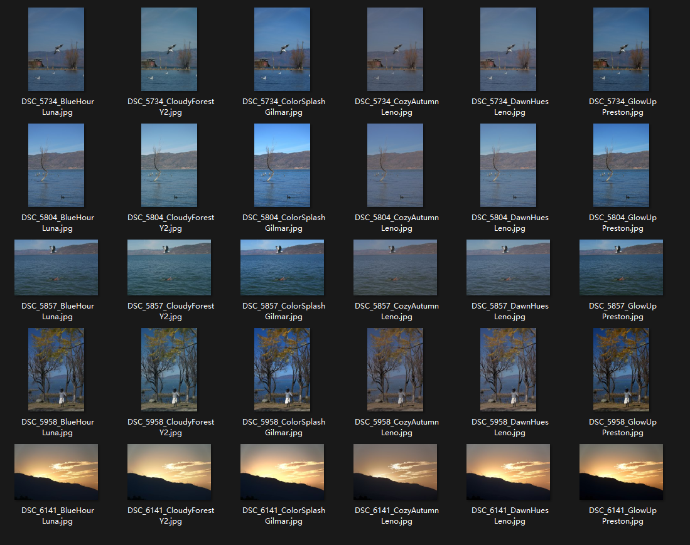

## 你的滤镜太多了，而时间太少

尼康云创上有上百款网友分享的滤镜，每个都号称"直出大片"。但导入机身后，一次只能看一张样片，切换滤镜需要翻菜单、点确认、再回放，你在相机屏幕前反复操作，几分钟过去，连第一个滤镜长什么样都忘了。

尼康工坊虽然能在电脑上切换滤镜，但列表一长交互就让人崩溃：没有缩略图预览，切换要等渲染，刚才看中那个滤镜叫什么来着？又得从头翻一遍。

但其实我们的**终极目标**，不是要在电脑中筛选滤镜，这只是一个过程，

**pfilter** 的目的地是：找到每个人最合适的滤镜，导入到机身，提供更大的**直出**可能性。

---

## 名称由来

**pfilter** = **p**ancake + **filter**，开发者昵称与滤镜（filter）的结合。filter 也意味着核心使命：批量套用滤镜、筛选对比、找到最合你审美的那一款。

本工具基于 Nikon SDK 开发，专为 **批量处理 Picture Control 滤镜** 设计。不是修图软件，而是帮你从海量滤镜中**高效筛选**的利器。

---

## 核心功能

### 批量处理配置中心

启动即进入配置窗口，所有操作一目了然：

- **RAW 文件列表**：支持 `.nef` / `.nrw` 格式，点击添加或直接拖拽到列表。
- **滤镜文件列表**：支持 `.np3` 滤镜文件，同样支持拖拽。
- **导出目录**：手动输入路径或点击 Browse 选择，灵活指定输出位置。
- **配置自动记忆**：程序自动保存上次的文件列表和导出路径，关掉重开接着用。RAW 和 NP3 的文件选择器各自独立记住最后打开的目录。

### 所见即所得的实时预览

选中任意一张 RAW 和任意一个滤镜，点击 **Preview**，右侧立刻呈现实际效果。无需导出、无需等待，切换滤镜秒级刷新。

预览处理在后台工作线程执行，UI 全程不卡顿。处理期间 Preview 按钮自动变为"Processing..."，状态一目了然。

### 全排列批量导出，一键生成

点击 **Export All**，程序自动执行 **[所有图片] × [所有滤镜]** 的全排列导出。假设你选了 10 张 RAW 和 15 个滤镜，一键生成 150 张 JPG，每张约 4 秒。

- **自动命名**：导出文件统一命名为 `图片名_滤镜名.jpg`，清晰可辨。
- **进度反馈**：状态栏实时显示"Exporting 3/12..."，Export 按钮变为"Cancel (3/12)"。
- **随时中断**：导出过程中再次点击按钮即可取消，已完成的文件保留不丢。
- **覆盖确认**：导出前预检所有输出路径，有文件已存在则弹出确认框。

### EXIF 完整保留

导出的 JPG 不是"白板"——pfilter 会自动将 RAW 文件的 EXIF 元数据（机身型号、镜头信息、光圈、快门、ISO、焦距、拍摄时间等）完整写入导出的 JPG。

这意味着导出的照片可以加参数相框、可以按时间归档、可以日后复盘拍摄参数。对摄影爱好者来说，这是照片的灵魂。

---

## 典型工作流

一次拍摄的完整处理流程：

1. **外出拍摄**：RAW 格式，把控好构图、曝光、对焦。
2. **回家选片**：从几十上百张底片中选出 5~10 张满意的。
3. **首轮滤镜筛选**：挑 1 张代表性底片，套上所有滤镜（比如 100+ 个），约 7 分钟导出 100 张 JPG。快速浏览，排除 80% 完全不合适的滤镜。
4. **二轮精选**：对剩余的 3~5 个候选滤镜，套上第 2 步选出的所有底片，约 2 分钟导出 30 张。对比选出最佳滤镜。
5. **记录归档**：把自己验证过的好滤镜记下来，逐渐积累专属滤镜库。
6. **进阶调参**：熟悉滤镜特性后，在尼康工坊中微调参数，打磨个人风格。

> 建议截图内容：导出目录中排列整齐的 JPG 文件，文件命名清晰（如 `DSC_0001_滤镜名.jpg`），展示批量输出的效果。

---

## 技术实现

pfilter 基于以下技术栈构建：

- **Nikon SDK**：通过 `NkImgSDK.dll` 加载 RAW 文件并应用 Picture Control 滤镜参数，获取处理后的图像数据。
- **自研 SDK Wrapper**：完全重写的 `CPfLibCtrl` 封装层，不依赖 Nikon 示例代码，接口清晰、日志完备。
- **MFC + GDI+**：Windows 原生 GUI 框架，GDI+ 保存 100% 质量 JPG（无二次压缩）。
- **异步架构**：预览和导出均在工作线程执行，UI 主线程通过自定义 Windows 消息接收进度通知，保持界面流畅。
- **EXIF 迁移**：自研 Go 语言 EXIF 解析器，将 RAW 文件的完整元数据移植到导出 JPG。
- **NP3 解析**：自研 TypeScript（Deno）解析器，读取 `.np3` 滤镜文件的具体参数值。

---

## 下载与反馈

pfilter 目前处于持续优化阶段，预计近期发布首个公开版本。

如果你是尼康用户，也对"直出"有执念，你对批量滤镜工具还有什么期待？你在筛选滤镜时还遇到过哪些麻烦？

欢迎把你的想法告诉我，我的邮箱：`pancake-lee@outlook.com`

---

_本工具基于 Nikon SDK 合法开发，遵循 SDK 许可协议。pfilter 是独立产品，与 Nikon Corporation 无关联。_

---
