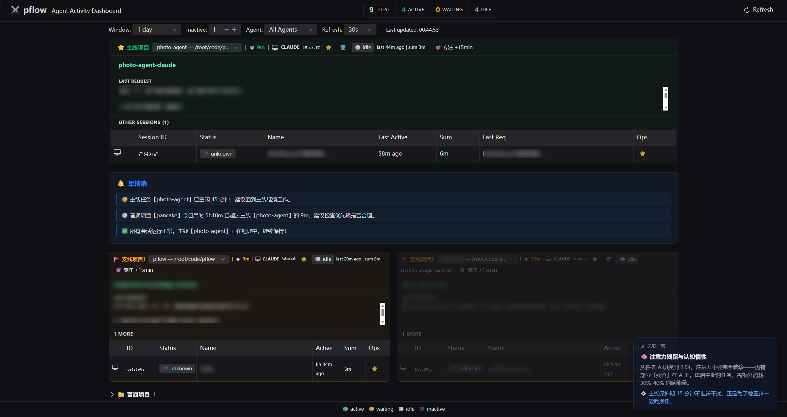
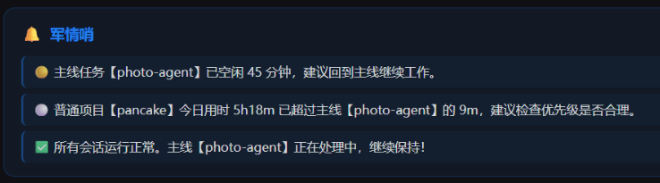

[上一篇文章](/pancake-io/posts/pflow-design-philosophy/) 讲了 PFlow 的设计哲学，它为什么不是又一个 Agent，以及游戏关卡设计如何启发了一套三幕认知引导流程。但这只讲了"为什么这样做"，没有展开"做出来是什么样"。

这篇文章补上另一半：**Dashboard 的完整功能、每个模块的设计决策，以及踩过的坑。**

> 如果你还不了解 PFlow 是什么：它是一个多 Agent 会话的注意力管理工具。你在终端里正常用 Claude Code、Hermes，它们自动出现在 Dashboard 上。PFlow 帮你一眼看清"哪个 Agent 在等我"，并给出注意力分配建议。

## Dashboard：两级视图，三区布局

Dashboard 的核心结构只有两层：**项目 → 会话**。没有 workspace、没有 team、没有 org，那些都是企业级工具的实体，对个人开发者是噪音。



页面按优先级分为三个区：

| 区域    | 颜色标记 | 数量限制  | 含义                             |
| ------- | -------- | --------- | -------------------------------- |
| ⭐ 主线 | 最高亮   | 1 个      | 今日最高优先级，主要精力投入方向 |
| 🚩 支线 | 次级     | 最多 2 个 | 可在等待间隙推进                 |
| 📁 普通 | 默认收起 | 不限      | 需要关注但不紧急                 |

**为什么是 1 主线 + 2 支线，而不是更多？**

这是个刻意的约束。同时追踪超过 3 个项目时，注意力分配本身就成了负担，你在 Dashboard 上花的时间比在实际工作上还多。1+2 的硬上限是一种**注意力保护机制**：它迫使你每天只聚焦最重要的三件事。

## 路径即项目：为什么不做独立的"项目"实体？

大多数工具会让你先"创建项目"再"把任务归入项目"。PFlow 反过来了，**不引入独立的项目实体，路径就是项目。**

Session 的 `working directory` 是天然的归属标识。你唯一需要做的操作是：在 Dashboard 上勾选 ☐ "识别为项目"。

背后的匹配逻辑是**最长前缀匹配**：

```
session cwd: /home/user/code/pflow/internal/api
项目根:      /home/user/code/pflow
→ 自动归入 pflow 项目

session cwd: /home/user/code/pflow
项目根:      /home/user/code
项目根:      /home/user/code/pflow  ← 更具体，胜出
→ 自动归入 pflow 项目
```

**零手动归类。** 你在终端里 `cd` 到某个目录、启动 Agent，它就自动出现在对应项目下。

额外有一层保护：`/` 不能被标记为项目根，防止所有 session 被错误地全部归入同一个项目。

> **为什么不做独立的项目实体？** 因为独立的项目 ID 和名称需要维护，而目录路径是你已经在维护的信息。不重复录入同一个事实，是数据建模的基本原则，只不过这次把它用在了产品设计上。

## Session 状态：四色信号灯

每个 Agent 会话在 Dashboard 上以一行卡片展示，最左侧是状态指示灯：

| 状态      | 颜色 | 含义                      | 检测方式                                        |
| --------- | ---- | ------------------------- | ----------------------------------------------- |
| 🟢 交战中 | 绿   | Agent 正在执行任务        | Claude Code statusline JSON 中 `status=running` |
| 🟡 待命   | 黄   | Agent 在等待用户确认/输入 | `status=waiting`，通常是有工具调用需要授权      |
| ⚪ 休整   | 灰   | Agent 空闲，无活跃任务    | `status=idle`                                   |
| ⚫ 静默   | 黑   | 会话存在但无最新状态      | 超过阈值时间未更新                              |

状态检测不侵入 Agent 本身，PFlow 只读取 Claude Code 的 statusline JSON 文件和 Hermes 的 export 输出，不做任何进程注入或 API 劫持。

这个设计的考量是：**不依赖 Agent 的配合。** 如果未来换了新的 AI 编程工具，只需要新增一个状态解析器，核心逻辑完全不变。

## 提醒分数算法：量化的"你该看一眼了"

Dashboard 不只是静态展示，它还会**动态计算每个项目对用户注意力的"紧迫程度"**，提醒分数。

综合四个输入维度：

| 输入       | 含义                                  | 来源         |
| ---------- | ------------------------------------- | ------------ |
| 等待时长   | 项目下 session 处于 🟡 waiting 的时间 | 状态扫描     |
| 专注持续   | 用户在当前项目上的连续活跃分钟数      | 活跃项目追踪 |
| 今日累计   | 今日各项目的累计投入时间              | 会话历史统计 |
| 项目优先级 | 主线(×2.0) / 支线(×1.5) / 普通(×1.0)  | 用户配置     |

核心行为逻辑：

- **15 分钟保护期**：刚切换任务时不打扰，给心流建立留出足够时间
- **幂函数加速**：专注 A 的时间越长，B 的提醒分数以幂函数曲线升高，而非线性。这防止了"1分钟后就开始催你"的骚扰，同时确保"3小时后还在催"的提醒确实有足够的信号强度
- **支线时间矫正**：支线占用超过主线时，自动提高主线提醒分数做反向牵引
- **分数差距放大**：幂函数刻意拉大不同项目之间的分数差距，防止 Dashboard 上多个项目同时"高亮"，那等于什么都没高亮

提醒分数不是"对错"判断，它只是回答一个问题：**"在你现在分心去看另一个项目之前，有没有什么事情值得你中断当前状态？"**

## 注意力遮罩：知觉信号，不是认知指令

提醒分数算出来之后，怎么呈现？

最直观的做法是弹窗，"您的支线项目有 Agent 在等待！"，但这恰恰是最糟糕的做法。

**弹窗是认知指令**：它抢占注意力焦点，强制中断当前思维流。被弹窗打断后，需要约 15 分钟才能恢复深度工作状态（中断代价理论）。

PFlow 的选择是**注意力遮罩层**，在项目卡片上叠加一层 CSS 伪元素，透明度随提醒分数从 0 到 0.3 之间缓慢变化：

- 提醒分数低时，遮罩完全透明，你甚至注意不到它
- 提醒分数逐渐升高，遮罩越来越明显，像窗外的天色变暗，你自然会注意到
- 分数超过阈值时，卡片边框开始微弱的呼吸动画，不是闪烁，是 3 秒周期的明暗渐变

**这是知觉信号，不是认知指令。** 它利用周边视觉而非中央视觉，不抢占注意力焦点。你知道它在变，但你可以选择忽略，就像余光看到窗外天色渐暗，你知道该考虑开灯了，但它不会打断你正在做的事。

遮罩层的 CSS 实现也有意做了隔离：`pointer-events: none`，遮罩不会拦截任何点击。它只影响视觉层，不影响交互层。

## 军情哨：~20 个场景的建议引擎

Dashboard 的右上角有一块 `SuggestCard` 区域，这就是**军情哨（Suggest）**。



它不是 LLM 驱动的闲聊机器人，而是一个**基于规则的场景匹配引擎**。当前版本覆盖 ~20 个静态场景，按优先级分为六类：

| 类别    | 触发条件示例                                                     | 优先级 |
| ------- | ---------------------------------------------------------------- | ------ |
| 🔴 紧急 | 任意项目 waiting > 5min、主线 waiting > 2min、多会话同时 waiting | 高     |
| 🟡 关注 | 主线空闲 > 30min、Agent 持续 busy > 10min（可能卡住了）          | 中     |
| 🔵 矫正 | 支线今日用时超过主线、注意力明显失衡                             | 低     |
| ✅ 正面 | 一切正常、主线今日高效完成                                       | 正向   |
| ⏰ 时间 | 午休后建议检查（13:00-14:00）、傍晚建议总结（18:00+）            | 提示   |
| ⚪ 提示 | 无活跃会话、全局空闲 > 30min                                     | 中性   |

建议卡片上还有一个**知识锚点**（`KnowledgeAnchor`），右下角的小卡片展示当前建议背后的认知科学原理（如"中断代价理论""知觉负载理论"等 12 条），随军情自动切换，支持轮播和悬停翻阅。

这个功能的设计原则是：**只做军情分析和建议，不自动调兵。** 系统告诉你"支线项目有个 Agent 已经等你 8 分钟了"，但它不会替你切过去。决定"切不切"的是你自己。

## 专注模式：手动拉起的保护罩

提醒系统是自动的，但有时候你比算法更清楚自己的状态，你知道接下来一小时绝对不能被打断。

这时候可以用**专注模式**。在任意项目卡片上点击"专注"按钮，系统为该项目的提醒设 15 分钟保护期。每次点击叠加 15 分钟，可连续叠加。保护期内：

- 非关注项目的提醒全部静默
- 非关注项目被统一遮罩
- 只显示当前项目的状态变化

专注模式到期后自动解除，无需手动操作。这个设计故意不做"永久免打扰"，**注意力保护应该是有意识的主动选择，而不是一次设置然后遗忘的配置项。**

## CLI：三句话上手

PFlow 不是 Web-first 的工具。它的主要操作路径是 CLI，Dashboard 是信息展示层：

```bash
# 打开 Web Dashboard（浏览器访问 http://localhost:8080）
pflow serve

# 在当前项目启动 Claude 托管会话（自动配置 tmux + statusline）
pflow claude -dir .

# 查看今日军情建议
pflow suggest
```

`pflow claude` 会自动创建 tmux 会话并配置 Claude Code 的 statusline，让会话状态对 Dashboard 可见。用户不需要理解 tmux 的内部机制，就像你不需要理解 HDMI 协议也能把电脑接上显示器。

## 技术架构总览

| 层级       | 技术                                        | 关键决策                                   |
| ---------- | ------------------------------------------- | ------------------------------------------ |
| CLI        | Cobra + Bubble Tea                          | Go 生态标准，终端交互成熟                  |
| Web        | Vue 3 + NaiveUI（Go embed 单二进制）        | `pflow serve` 一个命令启动全部，零依赖部署 |
| Agent 集成 | Claude Code statusline JSON + Hermes export | 不修改 Agent，只读取状态文件               |
| 会话管理   | tmux + ttyd                                 | 复用成熟方案，不自研终端                   |
| 状态扫描   | 文件轮询（~2s 间隔）                        | 简单的定时扫描已足够，不需要事件驱动       |
| 提醒算法   | 幂函数 + 时间衰减                           | 拉大分数差距，防止多任务同时高亮           |

### 为什么是 Go embed 单二进制？

Vue 3 SPA 打包后嵌入 Go binary，`pflow serve` 一个命令同时启动 API 服务和静态文件服务。不需要 `npm install`，不需要 `nginx`，不需要 Docker。

**对个人工具来说，部署复杂度是使用率的最大杀手。** 一个二进制文件 + 一个命令，比任何部署文档都有说服力。

## 换肤系统（未开发）

pflow起初设想就是“把工作设计得像游戏的任务系统”，那么在刚开始构思时，就想到了换肤系统。
用户可以更换贴图，甚至修改布局等等，去“装饰”自己的 dashboard：
比如原本是 **“主线任务长时间没有处理”** 的提醒，改成是你熟悉的卡通人物跳出来说 **“你很久没有跟我玩了~”**

---

PFlow 不是一个"大而全"的工具。它的功能边界被刻意收得很窄：**只呈现，不操作；只建议，不决策；只提醒，不打断。**

你可以把它理解为你的**AI 会话副驾驶**，它不帮你开车，但它让你看清路况。

> **项目地址**：[github.com/pancake-lee/pflow](https://github.com/pancake-lee/pflow)（MIT 开源）
>
> **相关阅读**：[PFlow 设计哲学：从游戏关卡设计到三幕认知引导](/pancake-io/posts/pflow-design-philosophy/) · [游戏设计中的心流](/pancake-io/posts/game-design-flow/)
